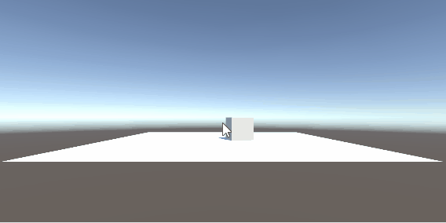
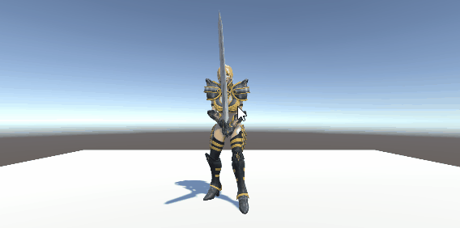
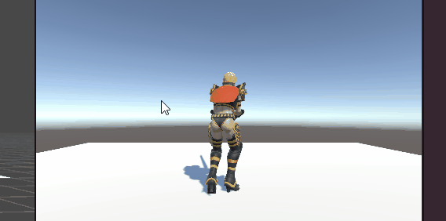
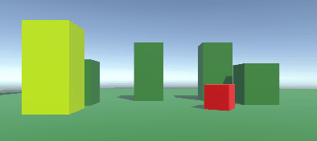
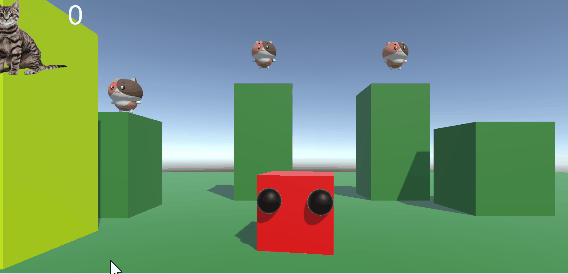
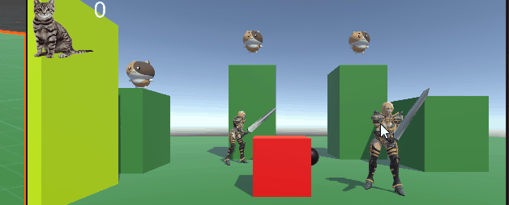

# Tutorial 0 launch cube
  
Ik heb ervoor gezorgd dat de cube lanceerd met de spatie knop  
[script](M3BOtutorials/Assets/Scripts/LaunchCube.cs)
# Tutorial 1 animatie trigger
  
Ik heb ervoor gezorgd dat de karakter kan dansen met een muisklik  
[script](M3BOtutorials/Assets/Scripts/Animatie.cs) 
# Tutorial 2 animatie + movement
  
ik heb een script gemaakt met movement zonder rotatie  
[script](M3BOtutorials/Assets/Scripts/NoRotationMovement.cs)
# Tutorial 3 platformer
  
ik heb een platformer gebouwt met een makkelijk jump script  
[script](M3BOtutorials/Assets/Scripts/Jump.cs)
# Tutorial 4 Pickups  
  
ik heb een pickup gemaakt met een score ui  
[Pickup script](M3BOtutorials/Assets/Scripts/GetPickup.cs)
[UI script](M3BOtutorials/Assets/Scripts/KeepScore.cs)  
# Tutorial 5 Schieten  
  
ik heb een schiet script en een explosie script gemaakt  
[explosie script](M3BOtutorials/Assets/Scripts/Explosion.cs)
[Schiet script](M3BOtutorials/Assets/Scripts/enemyhit.cs)